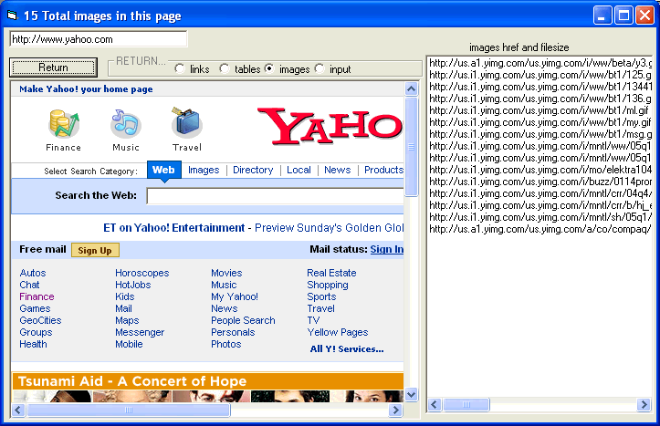



## webpage Document  Elements extractor

### Description

this class allows you to extract all the elements of specified type (this class includes, image, table,links, and input elements) of the webbrowsers document object..which is necessary if your going to be doing anything more than surfacy webbrowser related programming
 
### More Info
 

             |
---                |---
**Submitted On**   |2005-01-15 18:09:32
**By**             |[zoom2](https://github.com/Planet-Source-Code/PSCIndex/blob/master/ByAuthor/zoom2.md)
**Level**          |Intermediate
**User Rating**    |4.0 (36 globes from 9 users)
**Compatibility**  |VB 3\.0, VB 4\.0 \(16\-bit\), VB 4\.0 \(32\-bit\), VB 5\.0, VB 6\.0, VB Script, ASP \(Active Server Pages\) , VBA MS Access, VBA MS Excel
**Category**       |[Coding Standards](https://github.com/Planet-Source-Code/PSCIndex/blob/master/ByCategory/coding-standards__1-43.md)
**World**          |[Visual Basic](https://github.com/Planet-Source-Code/PSCIndex/blob/master/ByWorld/visual-basic.md)
**Archive File**   |[webpage\_Do1840111152005\.zip](https://github.com/Planet-Source-Code/zoom2-webpage-document-elements-extractor__1-58299/archive/master.zip)

